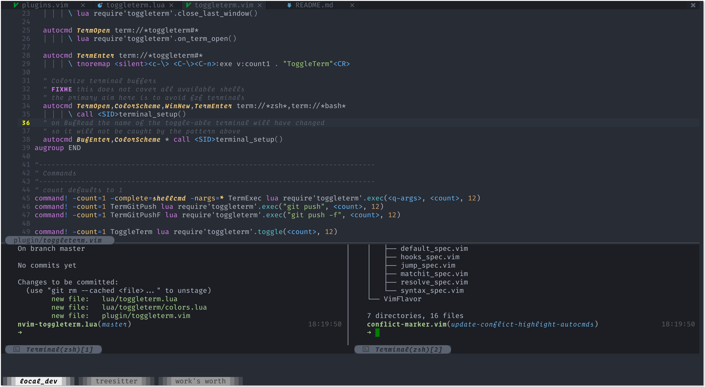

# nvim-toggleterm.lua

A _neovim_ plugin to persist and toggle multiple terminals during an editing session



## Why?

Neovim's terminal is a very cool, but not super ergonomic tool to use. I find that I often want to
set a process going and leave it continue to run in the background. I don't need to see it all the time though
just be able to refer back to it at intervals. I also sometimes want to create a new terminal and run a few commands.

Sometimes I want these side by side and I _really_ want these terminals to be easy to access and not clutter my buffer list.
I also want my terminal to look different from non terminal buffers so I use `winhighlight` to darken them based on the `Normal`
background colour.

This is the exact use case this was designed for. If that's your use case this might work for you. If not there are a lot of
much more stable alternatives.

## Why Lua?

I wrote this initially in vimscript as part of my `init.vim`. I then realised I wanted to extend the functionality
but didn't want to end up maintaining a bunch of vimscript I had just managed to hack into place 🤷.

**Status**: Alpha

It sort of works fine for the exact use case above, but there are undoubtedly some niggling bugs

## Roadmap

All I really want this plugin to be is what I described above. A wrapper around the terminal functionality.

It basically almost does all that I need it to.

I won't be turning this into a REPL plugin or doing a bunch of more complex stuff.
If you find any issues _please_ consider **pull request** not an issue. I won't be breaking my back to maintain
this especially if it isn't broken "on my machine". I'm also going to be pretty conservative about what I add,
I built this just to go over the top of neovim's builtin terminal not to do a bunch more extra stuff that it doesn't do.

### Usage

```
Coming soon...
```

### Todo

- [ ] Remove default mappings
