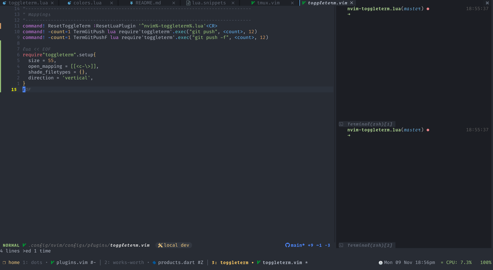

<!-- panvimdoc-ignore-start -->

<h1 align="center">
  toggleterm.nvim
</h1>

<!-- panvimdoc-ignore-end -->

<!-- panvimdoc-ignore-start -->

<p align="center">A <i>neovim</i> plugin to persist and toggle multiple terminals during an editing session</p>

<!-- panvimdoc-ignore-end -->

<!-- panvimdoc-ignore-start -->


<!-- panvimdoc-ignore-end -->

### Multiple orientations

- **Float**

<!-- panvimdoc-ignore-start -->


<!-- panvimdoc-ignore-end -->

- **Vertical**

<!-- panvimdoc-ignore-start -->



<!-- panvimdoc-ignore-end -->

- **Tab**

<!-- panvimdoc-ignore-start -->


<!-- panvimdoc-ignore-end -->

### Send commands to different terminals

<!-- panvimdoc-ignore-start -->


<!-- panvimdoc-ignore-end -->

### Winbar (Experimental/Nightly ONLY)

<!-- panvimdoc-ignore-start -->


<!-- panvimdoc-ignore-end -->

## Requirements

This plugin only works in _Neovim 0.7_ or newer.

## Installation

Using packer in lua

```lua
use {"akinsho/toggleterm.nvim", tag = '*', config = function()
  require("toggleterm").setup()
end}
```

Using vim-plug in vimscript

```vim
Plug 'akinsho/toggleterm.nvim', {'tag' : '*'}
```

You can/should specify a tag for the current major version of the plugin, to avoid breaking changes as this plugin evolves.
To use a version of this plugin compatible with nvim versions less than 0.7 please use the tag `v1.*`.

## Notices

- **28/07/1990** — If using `persist_mode` terminal mappings should be changed to use `wincmd` instead otherwise persist mode will not work correctly. See [here](#terminal-window-mappings) for details.

## Why?

Neovim's terminal is a very cool, but not super ergonomic tool to use. I find that I often want to
set a process going and leave it to continue to run in the background. I don't need to see it all the time.
I just need to be able to refer back to it at intervals. I also sometimes want to create a new terminal and run a few commands.

Sometimes I want these side by side, and I _really_ want these terminals to be easy to access.
I also want my terminal to look different from non-terminal buffers, so I use `winhighlight` to darken them based on the `Normal`
background colour.

This is the exact use case this was designed for. If that's your use case this might work for you.

## Roadmap

All I really want this plugin to be is what I described above. A wrapper around the terminal functionality.

It basically (almost) does all that I need it to.

I won't be turning this into a REPL plugin or doing a bunch of complex stuff.
If you find any issues, _please_ consider a _pull request_ not an issue.
I'm also going to be pretty conservative about what I add.

### Setup

This plugin must be explicitly enabled by using `require("toggleterm").setup{}`

Setting the `open_mapping` key to use for toggling the terminal(s) will set up mappings for _normal_ mode
If you prefix the mapping with a number that particular terminal will be opened.

If you set the `insert_mappings` key to true, the mapping will also take effect in insert mode; similarly setting `terminal_mappings` to will have the mappings take effect in the opened terminal.

However you will not be able to use a count with the open mapping in terminal and insert modes. You can create buffer specific mappings to exit terminal mode and then use a count with the open mapping. Check _Terminal window mappings_ for an example of how to do this.

alternatively you can do this manually (not recommended but, your prerogative)

```vim
" set
autocmd TermEnter term://*toggleterm#*
      \ tnoremap <silent><c-t> <Cmd>exe v:count1 . "ToggleTerm"<CR>

" By applying the mappings this way you can pass a count to your
" mapping to open a specific window.
" For example: 2<C-t> will open terminal 2
nnoremap <silent><c-t> <Cmd>exe v:count1 . "ToggleTerm"<CR>
inoremap <silent><c-t> <Esc><Cmd>exe v:count1 . "ToggleTerm"<CR>
```

**NOTE**: Please ensure you have set `hidden` in your neovim config, otherwise the terminals will be discarded when closed.

**WARNING**: Please do not copy and paste this configuration! It is here to show what options are available. It is not written to be used as is.

```lua
require("toggleterm").setup{
  -- size can be a number or function which is passed the current terminal
  size = 20 | function(term)
    if term.direction == "horizontal" then
      return 15
    elseif term.direction == "vertical" then
      return vim.o.columns * 0.4
    end
  end,
  open_mapping = [[<c-\>]],
  on_create = fun(t: Terminal), -- function to run when the terminal is first created
  on_open = fun(t: Terminal), -- function to run when the terminal opens
  on_close = fun(t: Terminal), -- function to run when the terminal closes
  on_stdout = fun(t: Terminal, job: number, data: string[], name: string) -- callback for processing output on stdout
  on_stderr = fun(t: Terminal, job: number, data: string[], name: string) -- callback for processing output on stderr
  on_exit = fun(t: Terminal, job: number, exit_code: number, name: string) -- function to run when terminal process exits
  hide_numbers = true, -- hide the number column in toggleterm buffers
  shade_filetypes = {},
  autochdir = false, -- when neovim changes it current directory the terminal will change it's own when next it's opened
  highlights = {
    -- highlights which map to a highlight group name and a table of it's values
    -- NOTE: this is only a subset of values, any group placed here will be set for the terminal window split
    Normal = {
      guibg = "<VALUE-HERE>",
    },
    NormalFloat = {
      link = 'Normal'
    },
    FloatBorder = {
      guifg = "<VALUE-HERE>",
      guibg = "<VALUE-HERE>",
    },
  },
  shade_terminals = true, -- NOTE: this option takes priority over highlights specified so if you specify Normal highlights you should set this to false
  shading_factor = '<number>', -- the degree by which to darken to terminal colour, default: 1 for dark backgrounds, 3 for light
  start_in_insert = true,
  insert_mappings = true, -- whether or not the open mapping applies in insert mode
  terminal_mappings = true, -- whether or not the open mapping applies in the opened terminals
  persist_size = true,
  persist_mode = true, -- if set to true (default) the previous terminal mode will be remembered
  direction = 'vertical' | 'horizontal' | 'tab' | 'float',
  close_on_exit = true, -- close the terminal window when the process exits
  shell = vim.o.shell, -- change the default shell
  auto_scroll = true, -- automatically scroll to the bottom on terminal output
  -- This field is only relevant if direction is set to 'float'
  float_opts = {
    -- The border key is *almost* the same as 'nvim_open_win'
    -- see :h nvim_open_win for details on borders however
    -- the 'curved' border is a custom border type
    -- not natively supported but implemented in this plugin.
    border = 'single' | 'double' | 'shadow' | 'curved' | ... other options supported by win open
    -- like `size`, width and height can be a number or function which is passed the current terminal
    width = <value>,
    height = <value>,
    winblend = 3,
  },
  winbar = {
    enabled = false,
    name_formatter = function(term) --  term: Terminal
      return term.name
    end
  },
}
```

### Usage

### `ToggleTerm`

This is the command the mappings call under the hood. You can use it directly
and prefix it with a count to target a specific terminal. This function also takes
arguments `size`, `dir` and `direction`. e.g.

```vim
:ToggleTerm size=40 dir=~/Desktop direction=horizontal
```

If `dir` is specified on creation toggle term will open at the specified directory.
If the terminal has already been opened at a particular directory it will remain in that directory.

The directory can also be specified as `git_dir` which toggleterm will then
use to try and derive the git repo directory.
_NOTE_: This will not work for `git-worktrees` or other more complex setups.

If `size` is specified, and the command opens a split (horizontal/vertical) terminal,
the height/width of all terminals in the same direction will be changed to `size`.

If `direction` is specified, and the command opens a terminal,
the terminal will be changed to the specified direction.

`size` and `direction` are ignored if the command closes a terminal.

#### Caveats

- Having multiple terminals with different directions open at the same time is unsupported.

### `ToggleTermToggleAll`

This command allows you to open all the previously toggled terminal in one go
or close all the open terminals at once.

### `TermExec`

This command allows you to open a terminal with a specific action.
e.g. `2TermExec cmd="git status" dir=~/<my-repo-path>` will run git status in terminal 2.
note that the `cmd` argument **must be quoted**.

_NOTE:_ the `dir` argument can also be _optionally_ quoted if it contains spaces.

The `cmd` and `dir` arguments can also expand the same special keywords as `:h expand` e.g.
`TermExec cmd="echo %"` will be expanded to `TermExec cmd="echo /file/example"`

These special keywords can be escaped using the `\` character, if you want to print character as is.

The `size` and `direction` arguments are like the `size` and `direction` arguments of `ToggleTerm`.

By default, focus is returned to the original window after executing the command
(except for floating terminals). Use argument `go_back=0` to disable this behaviour.

You can send commands to a terminal without opening its window by using the `open=0` argument.

see `:h expand()` for more details

### Sending lines to the terminal

You can "send lines" to the toggled terminals with the following commands:

- `:ToggleTermSendCurrentLine <T_ID>`: sends the whole line where you are standing with your cursor
- `:ToggleTermSendVisualLines <T_ID>`: sends all the (whole) lines in your visual selection
- `:ToggleTermSendVisualSelection <T_ID>`: sends only the visually selected text (this can be a block of text or a selection in a single line)

(`<T_ID` is an optional terminal ID parameter, which defines where should we send the lines.
If the parameter is not provided, then the default is the `first terminal`)

<!-- panvimdoc-ignore-start -->

Example:

<!-- panvimdoc-ignore-end -->

<!-- panvimdoc-ignore-start -->

<video src="https://user-images.githubusercontent.com/18753533/159889865-724becab-877b-45a2-898e-820afd6a4ee1.mov" controls="controls" muted="muted" height="640px"></video>

<!-- panvimdoc-ignore-end -->

### ToggleTermSetName

This function allows setting a display name for a terminal. This name is primarily used inside the winbar, and can be a more descriptive way
to remember, which terminal is for what.

You can map this to a key and call it with a count, which will then prompt you a name for the terminal with the matching ID.
Alternatively you can call it with just the name e.g. `:ToggleTermSetName work<CR>` this will the prompt you for which terminal it should apply to.
Lastly you can call it without any arguments, and it will prompt you for which terminal it should apply to then prompt you for the name to use.

### Set terminal shading

This plugin automatically shades terminal filetypes to be darker than other window
you can disable this by setting `shade_terminals = false` in the setup object

```lua
require'toggleterm'.setup {
  shade_terminals = false
}
```

alternatively you can set, _which_ filetypes should be shaded by setting

```lua
-- fzf is just an example
require'toggleterm'.setup {
  shade_filetypes = { "none", "fzf" }
}

```

setting `"none"` will allow normal terminal buffers to be highlighted.

### Set persistent size

By default, this plugin will persist the size of horizontal and vertical terminals.
Split terminals in the same direction always have the same size.
You can disable this behaviour by setting `persist_size = false` in the setup object.
Disabling this behaviour forces the opening terminal size to the `size` defined in the setup object.

```lua
require'toggleterm'.setup{
  persist_size = false
}
```

### Terminal window mappings

It can be helpful to add mappings to make moving in and out of a terminal easier
once toggled, whilst still keeping it open.

```lua
function _G.set_terminal_keymaps()
  local opts = {buffer = 0}
  vim.keymap.set('t', '<esc>', [[<C-\><C-n>]], opts)
  vim.keymap.set('t', 'jk', [[<C-\><C-n>]], opts)
  vim.keymap.set('t', '<C-h>', [[<Cmd>wincmd h<CR>]], opts)
  vim.keymap.set('t', '<C-j>', [[<Cmd>wincmd j<CR>]], opts)
  vim.keymap.set('t', '<C-k>', [[<Cmd>wincmd k<CR>]], opts)
  vim.keymap.set('t', '<C-l>', [[<Cmd>wincmd l<CR>]], opts)
end

-- if you only want these mappings for toggle term use term://*toggleterm#* instead
vim.cmd('autocmd! TermOpen term://* lua set_terminal_keymaps()')
```

### Custom Terminals


_using [lazygit](https://github.com/jesseduffield/lazygit)_

Toggleterm also exposes the `Terminal` class so that this can be used to create custom terminals
for showing terminal UIs like `lazygit`, `htop` etc.

Each terminal can take the following arguments:

```lua
Terminal:new {
  cmd = string -- command to execute when creating the terminal e.g. 'top'
  direction = string -- the layout for the terminal, same as the main config options
  dir = string -- the directory for the terminal
  close_on_exit = bool -- close the terminal window when the process exits
  highlights = table -- a table with highlights
  env = table -- key:value table with environmental variables passed to jobstart()
  clear_env = bool -- use only environmental variables from `env`, passed to jobstart()
  on_open = fun(t: Terminal) -- function to run when the terminal opens
  on_close = fun(t: Terminal) -- function to run when the terminal closes
  auto_scroll = boolean -- automatically scroll to the bottom on terminal output
  -- callbacks for processing the output
  on_stdout = fun(t: Terminal, job: number, data: string[], name: string) -- callback for processing output on stdout
  on_stderr = fun(t: Terminal, job: number, data: string[], name: string) -- callback for processing output on stderr
  on_exit = fun(t: Terminal, job: number, exit_code: number, name: string) -- function to run when terminal process exits
}
```

#### Custom terminal usage

```lua
local Terminal  = require('toggleterm.terminal').Terminal
local lazygit = Terminal:new({ cmd = "lazygit", hidden = true })

function _lazygit_toggle()
  lazygit:toggle()
end

vim.api.nvim_set_keymap("n", "<leader>g", "<cmd>lua _lazygit_toggle()<CR>", {noremap = true, silent = true})
```

This will create a new terminal, but the specified command is not being run immediately.
The command will run once the terminal is opened. Alternatively `term:spawn()` can be used
to start the command in a background buffer without opening a terminal window yet. If the
`hidden` key is set to true, this terminal will not be toggled by normal toggleterm commands
such as `:ToggleTerm` or the open mapping. It will only open and close by using the returned
terminal object. A mapping for toggling the terminal can be set as in the example above.

Alternatively the terminal can be specified with a count, which is the number that can be used
to trigger this specific terminal. This can then be triggered using the current count e.g.
`:5ToggleTerm<CR>`

```lua
local lazygit = Terminal:new({ cmd = "lazygit", count = 5 })
```

You can also set a custom layout for a terminal.

```lua
local lazygit = Terminal:new({
  cmd = "lazygit",
  dir = "git_dir",
  direction = "float",
  float_opts = {
    border = "double",
  },
  -- function to run on opening the terminal
  on_open = function(term)
    vim.cmd("startinsert!")
    vim.api.nvim_buf_set_keymap(term.bufnr, "n", "q", "<cmd>close<CR>", {noremap = true, silent = true})
  end,
  -- function to run on closing the terminal
  on_close = function(term)
    vim.cmd("startinsert!")
  end,
})

function _lazygit_toggle()
  lazygit:toggle()
end

vim.api.nvim_set_keymap("n", "<leader>g", "<cmd>lua _lazygit_toggle()<CR>", {noremap = true, silent = true})
```

**WARNING**: do not use any of the private functionality of the terminal or other non-public parts of the API as these
can change in the future.

### Statusline

To tell each terminal apart you can use the terminal buffer variable `b:toggle_number`
in your statusline

```vim
" this is pseudo code
let statusline .= '%{&ft == "toggleterm" ? "terminal (".b:toggle_number.")" : ""}'
```

### Custom commands

You can create your on commands by using the lua functions this plugin provides directly

```vim
command! -count=1 TermGitPush  lua require'toggleterm'.exec("git push",    <count>, 12)
command! -count=1 TermGitPushF lua require'toggleterm'.exec("git push -f", <count>, 12)
```

### Open multiple terminals side-by-side

| Direction  | Supported |
| ---------- | --------- |
| vertical   | ✔️        |
| horizontal | ✔️        |
| tab        | ✖️        |
| float      | ✖️        |

In your first terminal, you need to leave the `TERMINAL` mode using <kbd>C-\\</kbd><kbd>C-N</kbd> which can be remapped to <kbd>Esc</kbd> for ease of use.


Then you type on: `2<C-\>`, and the result:


Explain:

- `2`: this is the terminal's number (or ID), your first terminal is `1` (e.g. your 3rd terminal will be `3<C-\>`, so on).
- <kbd>C-\\</kbd>: this is the combined key mapping to the command `:ToggleTerm`.

### FAQ

#### How do I get this plugin to work with Powershell?

Please check out the [Wiki section on this topic](https://github.com/akinsho/toggleterm.nvim/wiki/Tips-and-Tricks#using-toggleterm-with-powershell).
